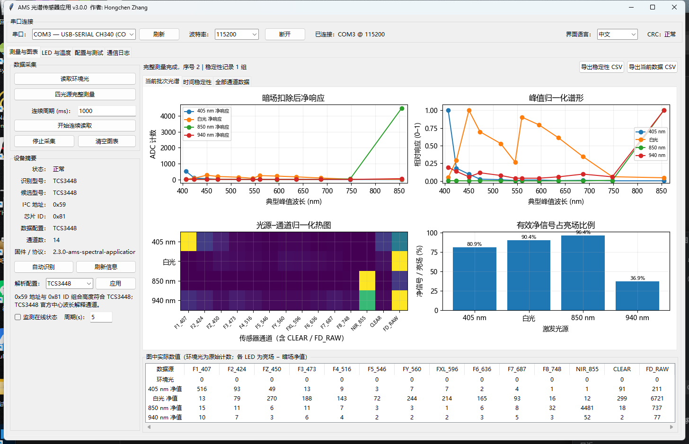
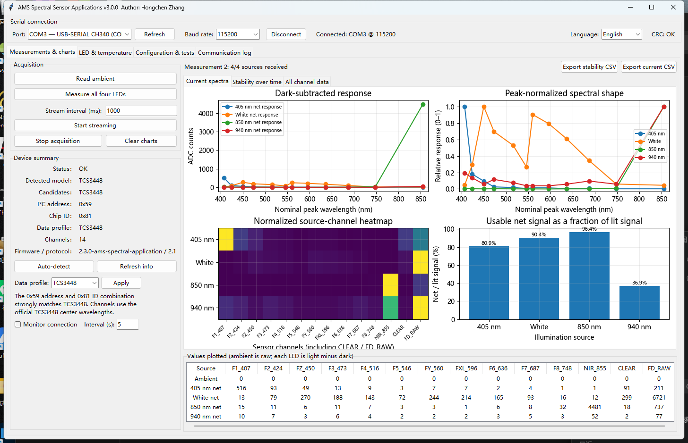
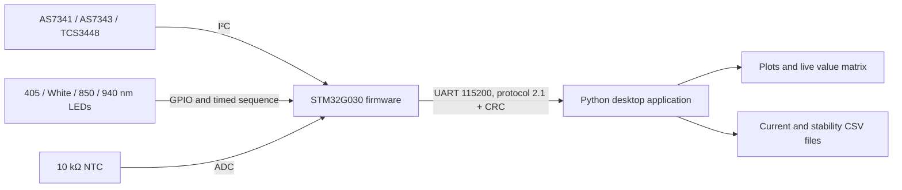

# AMS Spectral Sensor Applications

[中文说明](README.zh-CN.md)

STM32 firmware and a Python desktop application for a reusable AMS spectral-sensor board. The current release supports **AS7341**, **AS7343**, and **TCS3448**, automatically selects the matching register protocol, and adapts channel labels and plots at runtime.



## Highlights

- Automatic detection of AS7341 at `0x39`, AS7343 at `0x39`, and TCS3448 at `0x59`.
- Correct manual-SMUX acquisition for AS7341 and automatic-SMUX acquisition for AS7343/TCS3448.
- Four-source sequence: 405 nm, white, 850 nm, and 940 nm, with a separately acquired dark frame for every source.
- A 50 ms stabilization delay after switching a source on or off.
- Per-source automatic gain, raw lit and dark samples, dark-subtracted values, saturation flags, integration settings, and board temperature.
- Chinese desktop UI by default; switch to English without disconnecting the board or clearing measurements.
- Dynamic tables and plots driven by the firmware `CHANNELS` frame, so each sensor keeps its own channel count and wavelength labels.
- CRC-protected serial protocol, current-spectrum CSV export, and repeated-measurement stability export.

## Quick start

1. Install Python 3.10 or newer. Keep **Tcl/Tk** selected in the Python installer.
2. Open `host-software` and run `install_dependencies.bat` once.
3. Connect the board USB serial port and run `run.bat`.
4. Select the COM port, click **Connect**, and confirm the detected family and I²C address.
5. Click **Measure all four LEDs**. The charts and the source-by-channel value matrix update as each source completes.

Linux/macOS users can run `./install_dependencies.sh` and `./run.sh` when Python includes Tk support.

For firmware import, building, and flashing, see [Firmware build guide](docs/FIRMWARE_BUILD.md). For all desktop controls, see the [User guide](docs/USER_GUIDE.md).

## Supported sensors

| Sensor | I²C | Acquisition | Reported values | Verification |
|---|---:|---|---:|---|
| AS7341 | `0x39` | Two manual-SMUX passes | 10 | Hardware tested |
| AS7343 | `0x39` | Three automatic-SMUX cycles | 14 | Driver path implemented; awaits a confirmed sample |
| TCS3448 | `0x59` | Three automatic-SMUX cycles | 14 | Hardware tested |

AS7341L and AS7343L channel profiles are retained as manual interpretation options. They are not part of the three officially verified targets in this release. The exact `L`/non-`L` orderable part cannot always be proven from digital ID registers alone; see [Sensor identification and channels](docs/SENSOR_SUPPORT.md).

## What the application shows

- Dark-subtracted response against nominal peak wavelength.
- Peak-normalized spectral shape.
- A normalized source-channel heatmap including `CLEAR` and `FD_RAW` where available.
- Usable net signal as a fraction of the lit reading.
- Repeated-measurement stability normalized to 1× gain.
- NTC temperature history.
- The actual ambient and four LED values for every reported channel.



## Project layout

```text
firmware/stm32g030/       STM32CubeIDE project for STM32G030C8T6
host-software/            Python/Tk desktop application and launch scripts
docs/                     Bilingual guides, protocol notes, and screenshots
CHANGELOG.md              Version history
VERSION.txt               Current firmware, protocol, and host versions
```

The repository intentionally excludes PCB design files, archived experiments, logs, compiled binaries, and obsolete host tools.

## Architecture



## Documentation

- [Desktop user guide](docs/USER_GUIDE.md) · [中文](docs/USER_GUIDE.zh-CN.md)
- [Firmware build and flash](docs/FIRMWARE_BUILD.md) · [中文](docs/FIRMWARE_BUILD.zh-CN.md)
- [Sensor identification and channels](docs/SENSOR_SUPPORT.md) · [中文](docs/SENSOR_SUPPORT.zh-CN.md)
- [Serial protocol 2.1](docs/SERIAL_PROTOCOL.md) · [中文](docs/SERIAL_PROTOCOL.zh-CN.md)
- [Troubleshooting](docs/TROUBLESHOOTING.md) · [中文](docs/TROUBLESHOOTING.zh-CN.md)

## Versions

- Firmware: `2.3.0-ams-spectral-application`
- Serial protocol: `2.1`
- Desktop application: `3.0.0`

The firmware was rebuilt with STM32CubeIDE 2.2.0 / GNU Tools for STM32 14.3.rel1. AS7341 and TCS3448 live acquisition paths have been exercised on the target board.

