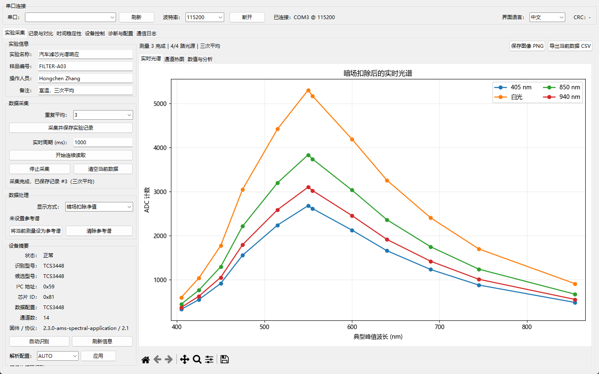
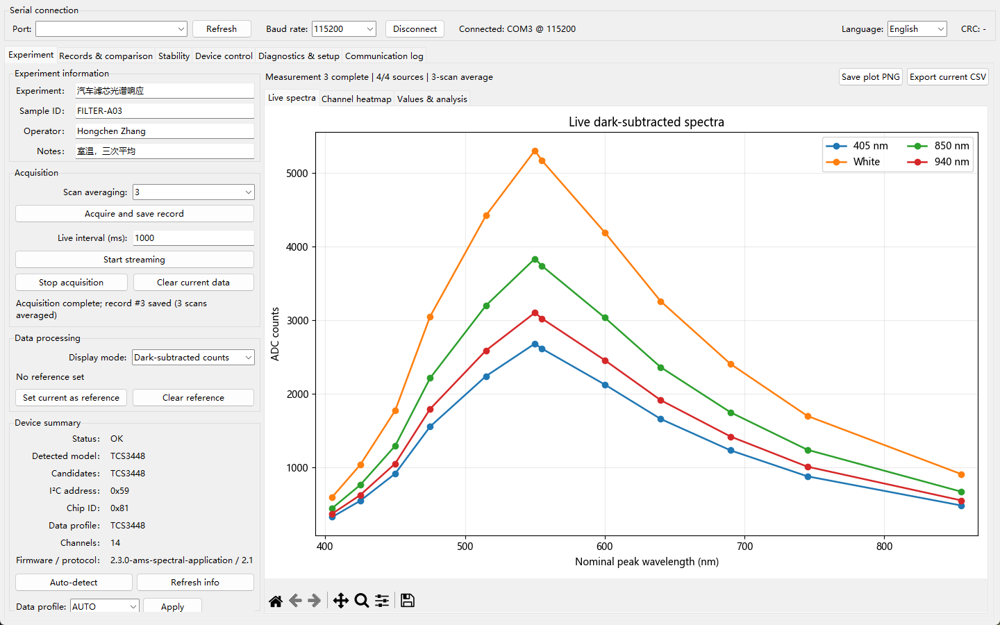

# AMS Spectral Sensor Applications

[中文说明](README.zh-CN.md)

STM32 firmware and a Python desktop application for **AS7341, AS7343, and TCS3448**. The firmware detects the sensor, and the desktop application uses the returned channel table.



## Features

- Detects AS7341/AS7343 at `0x39` and TCS3448 at `0x59`.
- Uses two manual-SMUX passes for AS7341 and three automatic-SMUX cycles for AS7343/TCS3448.
- Measures 405 nm, white, 850 nm, and 940 nm sources with a separate dark frame for each source.
- Keeps independent automatic gain, lit/dark/net values, saturation flags, integration settings, and board temperature for each source.
- Experiment metadata for experiment name, sample ID, operator, and notes.
- 1/3/5/10-scan averaging with gain and integration-time scaling before averaging.
- Reference spectra, relative response, absorbance, live spectra, a full-channel heatmap, actual values, and spectral metrics.
- Saved experiment records with sample overlays, CSV export for current/batch/stability data, and PNG plot export.
- CRC-protected serial frames and a Chinese-default interface with an English option.

## Quick start

1. Install Python 3.10 or newer with Tcl/Tk.
2. Open `host-software` and run `install_dependencies.bat`.
3. Connect the board over USB and run `run.bat`.
4. Select the COM port and click **Connect**.
5. Enter the sample information, select an averaging count, and click **Acquire and save record**.

See [Firmware build and flash](docs/FIRMWARE_BUILD.md) and the [Desktop application guide](docs/USER_GUIDE.md) for details.

## Supported sensors

| Sensor | I²C | Acquisition | Channels | Verification |
|---|---:|---|---:|---|
| AS7341 | `0x39` | Two manual-SMUX passes | 10 | Hardware tested |
| AS7343 | `0x39` | Three automatic-SMUX cycles | 14 | Not hardware tested |
| TCS3448 | `0x59` | Three automatic-SMUX cycles | 14 | Compatible `0x59 / ID 0x81` device tested |

AS7341L and AS7343L remain available as manual channel profiles. See [Sensor identification and channels](docs/SENSOR_SUPPORT.md) for detection rules and channel order.

## Experiment features

- Four-source dark-subtracted counts, relative response, and absorbance
- Reference management with acquisition-condition consistency checks
- Peak, integral, and centroid analysis over an adjustable wavelength range
- Actual values for every channel and a source-channel heatmap
- Sample record table, multi-record overlays, and long-table batch export
- Repeated-measurement stability normalized by gain and integration time
- NTC temperature history, LED control, and low-level diagnostics



## Layout

```text
firmware/stm32g030/       STM32CubeIDE project
host-software/            Python application and launch scripts
docs/                     Guides, protocol, and screenshots
CHANGELOG.md              Change history
VERSION.txt               Version information
```

## Documentation

- [Desktop application guide](docs/USER_GUIDE.md) · [中文](docs/USER_GUIDE.zh-CN.md)
- [Firmware build and flash](docs/FIRMWARE_BUILD.md) · [中文](docs/FIRMWARE_BUILD.zh-CN.md)
- [Sensor identification and channels](docs/SENSOR_SUPPORT.md) · [中文](docs/SENSOR_SUPPORT.zh-CN.md)
- [Serial protocol 2.1](docs/SERIAL_PROTOCOL.md) · [中文](docs/SERIAL_PROTOCOL.zh-CN.md)
- [Troubleshooting](docs/TROUBLESHOOTING.md) · [中文](docs/TROUBLESHOOTING.zh-CN.md)

## Versions

- Firmware: `2.3.0-ams-spectral-application`
- Serial protocol: `2.1`
- Desktop application: `4.0.0`
